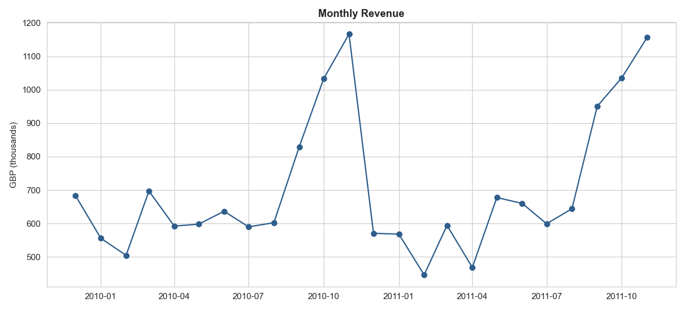
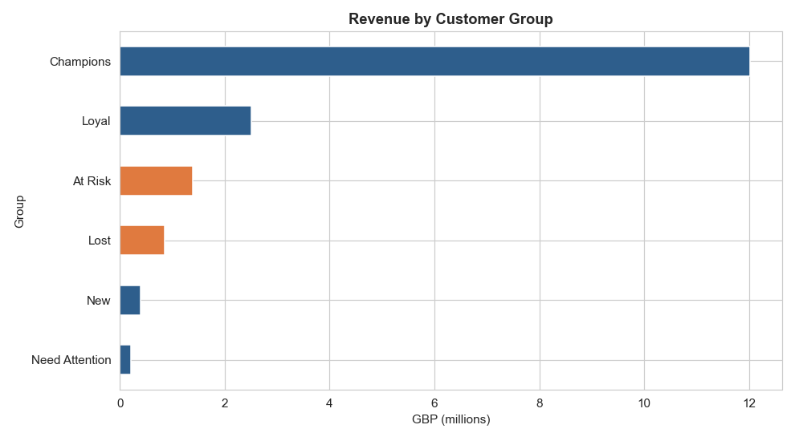
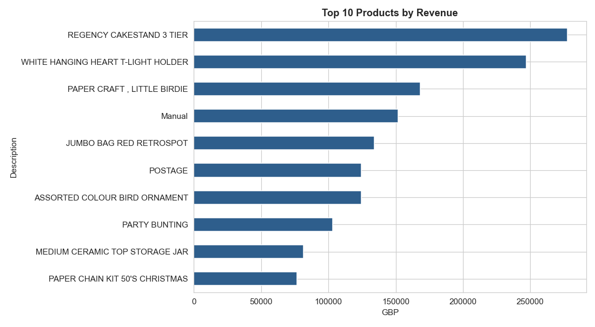
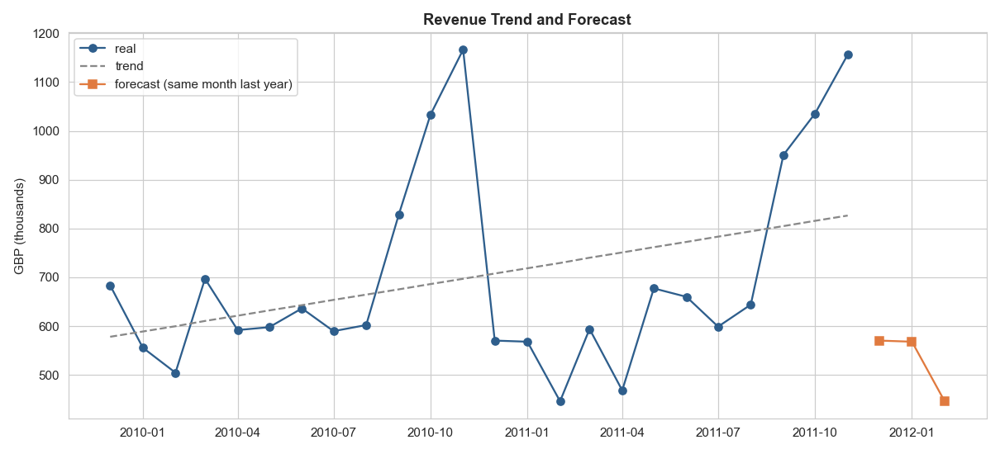
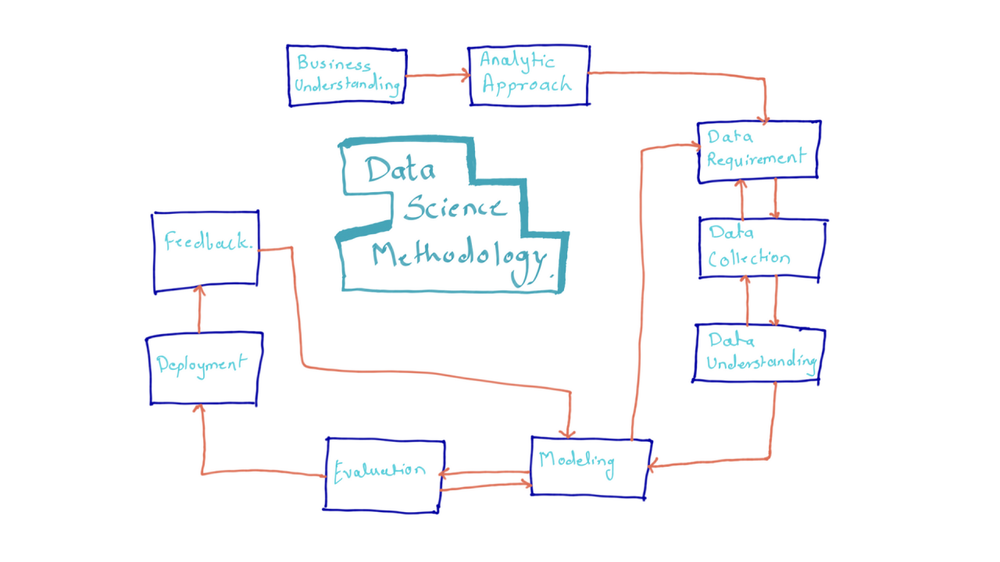

# Online Retail: Customer and Sales Analysis

I analyzed 2 years of sales from a UK online gift shop (about 1 million rows, 2009-2011).

I wanted to answer one question:

> **How can the shop earn more by keeping its best customers and bringing back the ones who left?**

## What I found

- A small group of customers brings most of the money. "Champions" are about 25% of customers, but they bring about **69%** of revenue.
- About **72%** of customers come back to buy again.
- But about **40%** of customers did not buy anything for more than 6 months. They are leaving quietly.
- Sales are seasonal. High in autumn, low in February and this pattern repeats in both years.

## Charts

| Sales by month | Customer groups |
|---|---|
|  |  |

| Top products | Forecast |
|---|---|
|  |  |

## My advice to the shop

1. Take care of the Champions because they bring most of the money.
2. Send a "we miss you" offer to the At Risk group, before they leave.
3. Buy more stock and do more marketing before autumn.
4. Make special offers in the slow winter months.
5. Sell bundles to raise the average order value.

## How I worked

I followed John Rollins' data science methodology, step by step:



The main method is **RFM analysis**. It gives every customer 3 scores: how recently they bought, how often, and how much money. Then I put customers in groups like "Champions", "At Risk", and "Lost".

Tools: Python, pandas, NumPy, matplotlib, seaborn.

## How to run it

1. Install the libraries:
   ```bash
   pip install -r requirements.txt
   ```
2. Download the data file (steps in `data/raw/README.md`).
3. Open the notebook:
   ```bash
   jupyter notebook notebooks/online_retail_analysis.ipynb
   ```

All results and charts are already inside the notebook.

## The data

Online Retail II, a free public dataset from the [UCI Machine Learning Repository](https://archive.ics.uci.edu/dataset/502/online+retail+ii). Real sales from a UK online gift shop, 2009-2011.

Note: this is data from one shop and one time period, and my forecast is a simple "same month last year" rule. So the numbers show a direction, not a final answer.
